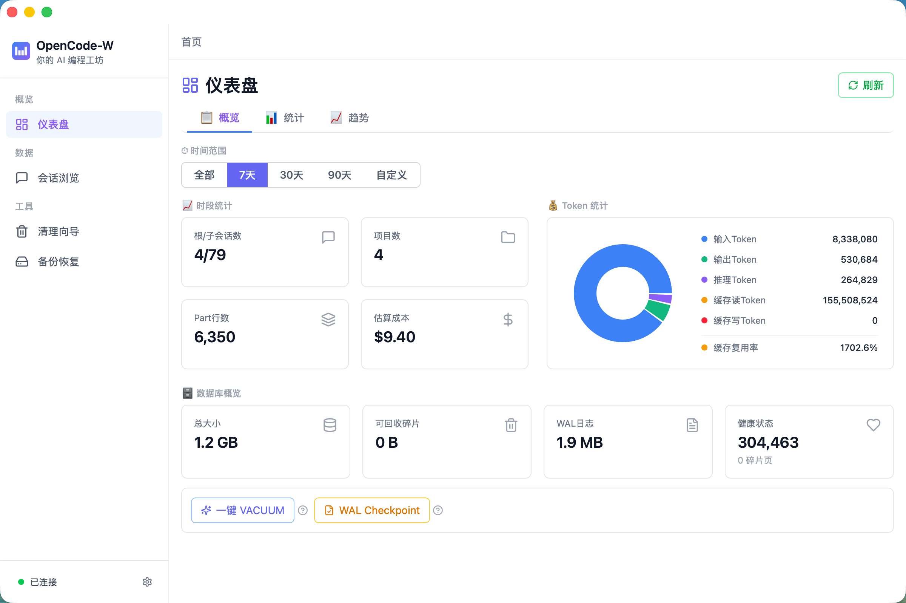

# OpenCode-W

> **社区工具，与 [OpenCode](https://github.com/anomalyco/opencode) 没有正式关联.**

> 让每一次 AI 对话，都成为你精进编程功力的工程资本

[](https://opensource.org/licenses/MIT)
[](https://www.electronjs.org/)
[](https://react.dev/)
[](https://www.typescriptlang.org/)
[](https://github.com/anomalyco/opencode)

## 📖 简介

OpenCode-W 是你的 AI 编程工程工坊。它将每次 OpenCode 对话自动沉淀为可分析的数据资产——Token 消耗、工具偏好、模型 ROI、成本趋势——让你看清自己的编程行为模式，用数据而非感觉来做技术决策，系统性提升编程工程化能力。

W = **W**orkshop（工坊），也是作者 **W**ebb 的印记。

> 基于 [OpenCode](https://github.com/anomalyco/opencode) 构建
>
> - ✅ **支持OpenCode v1.x 及以上版本**：`session` 表需包含 `parent_id` 列以支持会话层级（父子会话、根/子统计）。

## 🎯 为什么选择 OpenCode-W？

通用 SQLite 浏览器能打开任何数据库——但不懂 OpenCode 的 Schema。OpenCode-W 专为 OpenCode 打造：

| 你想要 | 通用工具 | OpenCode-W |
|--------|---------|------------|
| 知道花了多少钱 | ❌ 没有 AI 成本概念 | ✅ Token → 成本实时换算，趋势图一目了然 |
| 找到那轮调试对话 | ⚠️ 手写 SQL 搜 | ✅ 全文搜索 + 父子会话层级展开 |
| 看懂 AI 的内部运作 | ❌ 12 种 Part 类型看不懂 | ✅ 原生解析，按类型分 Tab 展示 |
| 安全清理旧数据 | ❌ DELETE 即执行，无后悔药 | ✅ 预览 → 确认 → 3 秒倒计时 |
| 开箱即用 | ⚠️ 需要选文件、懂 Schema | ✅ 自动检测 opencode.db，打开就用 |
| 管理全部历史会话 | ⚠️ TUI /sessions 仅显示近 30 天 | ✅ 任意时间会话的浏览、搜索、重命名、删除、迁移目录 |

> 💡 **关于 OpenCode 的会话可见性**：OpenCode TUI 的 `/sessions` 受 30 天时间窗口限制（[已知问题](https://github.com/anomalyco/opencode/issues/16270)），超出该范围的会话在 TUI 中不可见、不可操作。但这些数据仍在数据库中。**OpenCode-W 没有这个限制**——浏览、搜索、重命名、删除任意时间的历史会话，补全 OpenCode 在这些场景下的能力缺口。

👤 **谁适合用？** 每周用 OpenCode 产生数十上百次 AI 对话、想看清花费和效率、希望从「凭感觉写」进阶到「凭数据工程」的开发者。

## ✨ 功能特性



- 📊 **仪表盘** — 会话资产、Token 消耗、成本水位、工具排行，Dashboard 一眼看清 AI 编程全貌
- 💬 **会话浏览** — 父子会话完整工艺链，从需求到交付每一步都在这里，支持键盘导航
- 📝 **消息查看** — 原生对话流渲染，像复盘棋局一样回溯编程过程；全文搜索一秒定位关键方案
- 🧹 **清理向导** — 4 种清理策略，先预览再确认，3 秒倒计时安全回收，VACUUM 释放磁盘空间
- 💾 **备份恢复** — 一键备份、版本管理、灾难恢复，像 Git commit 一样养成定期存档习惯

## 🚀 快速开始

### 系统要求

- macOS 12.0+, Windows 10+, Linux (x64)
- Node.js 20.11.1 或更高版本（与 Electron 42 内嵌 Node 24 对齐）

### 安装

```bash
# 1. 克隆仓库
git clone https://github.com/WebbLee94/OpenCode-W.git
cd OpenCode-W

# 2. 安装依赖
npm install

# 3. 生成测试数据（可选）
npm run generate-fixture

# 4. 启动开发模式
npm run dev

# 5. 打包应用
npm run build
```

> 💡 自 v1.1.0 起已切换到 Node 内置 `node:sqlite`，**不再需要 `npm run rebuild-native`**，也彻底告别 `NODE_MODULE_VERSION` 报错。

## 🛠️ 技术栈

- **桌面框架**: Electron 42
- **前端**: React 18 + TypeScript 5
- **数据库**: `node:sqlite`（Node 24 内置，零原生模块）
- **样式**: Tailwind CSS 4
- **图表**: Recharts
- **构建工具**: Vite 5 + electron-builder 25
- **跨平台**: macOS Universal (arm64+x64) / Windows NSIS (x64+arm64) / Linux AppImage+deb (x64)

## 📁 项目结构

```
OpenCode-W/
├── electron/           # 主进程代码
│   ├── main.ts        # 主进程入口
│   ├── database.ts    # DatabaseManager 单例
│   ├── preload.ts     # contextBridge API
│   └── ipc/           # IPC 处理器
│       ├── analytics.ts   # Dashboard 数据聚合
│       ├── sessions.ts    # 会话 CRUD
│       ├── messages.ts    # 消息查询 + 全文搜索
│       ├── todos.ts       # 会话详情内嵌待办 Tab
│       ├── cleanup.ts     # 清理操作
│       └── backup.ts      # 备份恢复
├── src/               # 渲染进程代码
│   ├── features/      # 功能模块
│   │   ├── dashboard/     # 仪表盘
│   │   ├── sessions/      # 会话浏览
│   │   ├── messages/      # 消息查看
│   │   ├── cleanup/       # 清理向导
│   │   └── backup/        # 备份恢复
│   ├── components/    # 共享 UI 组件
│   └── lib/           # 工具函数
├── shared/            # 共享类型和常量
├── docs/              # 设计文档和用户手册
└── test-data/         # 测试数据
```

## 📚 文档

完整文档请参阅 [文档中心](docs/README.md)，按 8 维度分类组织所有设计文档。

## 💡 常见问题

### Q: 升级 Electron 后遇到 "NODE_MODULE_VERSION mismatch" 错误怎么办？

A: 自 v1.2.0 起已切换到 Node 内置 `node:sqlite`，**不再有原生模块**，此问题不再出现。

### Q: 清理后空间未释放怎么办？

A: 运行 VACUUM 或重启应用。

### Q: 备份文件存储在哪里？

A: 默认存储在 `~/.opencode-w/backups/` 目录。

## 🔧 数据库驱动

主进程使用 Node 24 内置 `node:sqlite`（`DatabaseSync`），不再使用 `better-sqlite3` 等 C++ 原生模块。

- 零外部依赖、零 ABI 风险、同步 API
- API 形态与 better-sqlite3 几乎一致，IPC handler 无需改为 async
- 升级 Electron 不再需要重新编译原生模块

## 🔒 代码签名

> ⚠️ **本仓库默认不包含代码签名证书**。
> macOS 用户首次打开会看到「无法验证开发者」提示，需在「系统设置 → 隐私与安全性」中点击「仍要打开」；Windows 会触发 SmartScreen 警告。生产环境分发建议自行配置 `CSC_LINK` / `CSC_KEY_PASSWORD` 环境变量与 `electron-builder.yml` 的 `csc` 段。

## 🤝 贡献

欢迎提交 Issue 和 Pull Request！

## 📄 许可证

本项目采用 MIT 许可证 - 详见 [LICENSE](LICENSE) 文件。

## 👥 作者

- **Webb Lee** - [Webb Lee](https://github.com/webbLee94)

---

Made with ❤️ by [Webb Lee](https://github.com/webbLee94)
