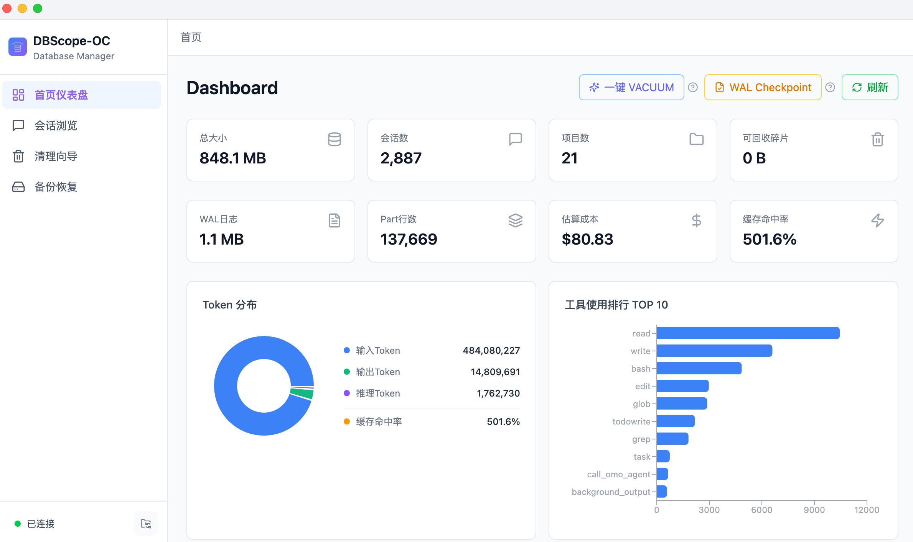

# DBScope-OC

> OpenCode 数据库可视化管理工具 - 轻松管理你的 OpenCode 会话数据

[](https://opensource.org/licenses/MIT)
[](https://www.electronjs.org/)
[](https://react.dev/)
[](https://www.typescriptlang.org/)
[](https://github.com/anomalyco/opencode)

## 📖 简介

DBScope-OC 是一款桌面应用，用于可视化管理 OpenCode 的 SQLite 数据库。支持查看数据库统计、浏览会话和消息、安全清理历史数据、备份恢复数据库。

> 基于 [OpenCode](https://github.com/anomalyco/opencode) 构建

## ✨ 功能特性



- 📊 **首页仪表盘** - 数据库大小、会话数、Token 统计、工具排行、技能分布、增长趋势
- 💬 **会话浏览** - 搜索、筛选、排序、分页、详情面板
- 📝 **消息查看器** - Markdown 渲染、Part 明细、Tool 展开、Token 分解
- 🧹 **清理向导** - 4 种策略、预览确认、3 秒倒计时安全机制
- 💾 **备份恢复** - 一键备份、版本管理、灾难恢复

## 🚀 快速开始

### 系统要求

- macOS 12.0 或更高版本
- Node.js 18.0 或更高版本

### 安装

```bash
# 1. 克隆仓库
git clone https://github.com/JieYueGo/DBScope-OC.git
cd DBScope-OC

# 2. 安装依赖
npm install

# 3. 重新编译原生模块（重要！否则无法运行）
npm run rebuild-native

# 4. 生成测试数据（可选）
npm run generate-fixture

# 5. 启动开发模式
npm run dev

# 6. 打包应用
npm run build
```

## 🛠️ 技术栈

- **桌面框架**: Electron
- **前端**: React 19 + TypeScript
- **数据库**: better-sqlite3
- **样式**: Tailwind CSS
- **图表**: Recharts
- **构建工具**: Vite

## 📁 项目结构

```
DBScope-OC/
├── electron/           # 主进程代码
│   ├── main.ts        # 主进程入口
│   ├── database.ts    # DatabaseManager 单例
│   ├── preload.ts     # contextBridge API
│   └── ipc/           # IPC 处理器
├── src/               # 渲染进程代码
│   ├── features/      # 功能模块
│   ├── components/    # 共享 UI 组件
│   └── lib/           # 工具函数
├── shared/            # 共享类型和常量
├── docs/              # 设计文档和用户手册
└── test-data/         # 测试数据
```

## 📚 文档

详细文档请参阅 [docs/](docs) 目录：

- [架构设计](docs/01-架构设计.md)
- [数据访问层](docs/02-数据访问层.md)
- [技术栈](docs/03-技术栈.md)
- [功能模块](docs/04-功能模块)
- [使用手册](docs/05-使用手册.md)

## 💡 常见问题

### Q: 遇到 "NODE_MODULE_VERSION mismatch" 错误怎么办？

A: 运行 `npm run rebuild-native` 重新编译原生模块。

### Q: 清理后空间未释放怎么办？

A: 运行 VACUUM 或重启应用。

### Q: 备份文件存储在哪里？

A: 默认存储在 `~/opencode-backups/` 目录。

## 🔧 原生模块说明

better-sqlite3 是 C++ 原生模块，必须针对 Electron 版本重新编译才能正常工作。每次升级 Electron 版本后都需要重新运行：

```bash
npm run rebuild-native
```

## 🤝 贡献

欢迎提交 Issue 和 Pull Request！

## 📄 许可证

本项目采用 MIT 许可证 - 详见 [LICENSE](LICENSE) 文件。

## 👥 作者

- **Webb Lee** - [Webb Lee](https://github.com/webbLee94)

---

Made with ❤️ by [Webb Lee](https://github.com/webbLee94)
