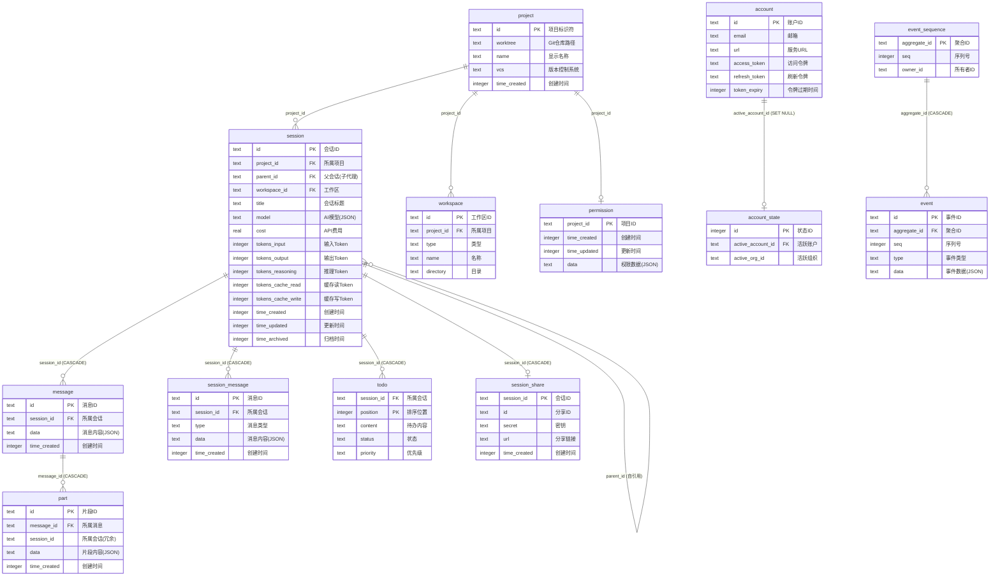

# 00-数据库Schema参考

## 概述

OpenCode 使用 SQLite（WAL 模式）存储所有数据，引擎为 Bun `bun:sqlite`。数据库版本通过 `__drizzle_migrations` 追踪 schema 变更，当前共 **15 张业务表 + 2 张系统表**。

**本文档内容**：
- 实体关系图（E-R 图）
- 所有表的完整建表 SQL
- 索引清单
- 外键关系说明
- 当前数据量参考

---

## E-R 图



### 关系速查

| 子表 | 父表 | 外键列 | 删除策略 |
|------|------|--------|---------|
| session | project | project_id | CASCADE |
| message | session | session_id | CASCADE |
| part | message | message_id | CASCADE |
| session_message | session | session_id | CASCADE |
| todo | session | session_id | CASCADE |
| session_share | session | session_id | CASCADE |
| permission | project | project_id | CASCADE |
| workspace | project | project_id | CASCADE |
| session | session | parent_id | 无约束(自引用) |
| event | event_sequence | aggregate_id | CASCADE |
| account_state | account | active_account_id | SET NULL |

---

## 建表 SQL

### 核心表

#### project — 项目

```sql
CREATE TABLE project (
    id                  text PRIMARY KEY,
    worktree            text NOT NULL,
    vcs                 text,
    name                text,
    icon_url            text,
    icon_color          text,
    icon_url_override   text,
    time_created        integer NOT NULL,
    time_updated        integer NOT NULL,
    time_initialized    integer,
    sandboxes           text NOT NULL,
    commands            text
);
```

#### session — 会话

```sql
CREATE TABLE session (
    id                  text PRIMARY KEY,
    project_id          text NOT NULL,
    parent_id           text,
    workspace_id        text,
    slug                text NOT NULL,
    directory           text NOT NULL,
    path                text,
    title               text NOT NULL,
    version             text NOT NULL,
    agent               text,
    model               text,
    cost                real DEFAULT 0 NOT NULL,
    tokens_input        integer DEFAULT 0 NOT NULL,
    tokens_output       integer DEFAULT 0 NOT NULL,
    tokens_reasoning    integer DEFAULT 0 NOT NULL,
    tokens_cache_read   integer DEFAULT 0 NOT NULL,
    tokens_cache_write  integer DEFAULT 0 NOT NULL,
    share_url           text,
    summary_additions   integer,
    summary_deletions   integer,
    summary_files       integer,
    summary_diffs       text,
    revert              text,
    permission          text,
    time_created        integer NOT NULL,
    time_updated        integer NOT NULL,
    time_compacting     integer,
    time_archived       integer,
    CONSTRAINT fk_session_project_id_project_id_fk
        FOREIGN KEY (project_id) REFERENCES project(id) ON DELETE CASCADE
);
```

#### message — 消息

```sql
CREATE TABLE message (
    id             text PRIMARY KEY,
    session_id     text NOT NULL,
    time_created   integer NOT NULL,
    time_updated   integer NOT NULL,
    data           text NOT NULL,
    CONSTRAINT fk_message_session_id_session_id_fk
        FOREIGN KEY (session_id) REFERENCES session(id) ON DELETE CASCADE
);
```

**`data` JSON 结构示例**：
```json
{
  "role": "user|assistant",
  "agent": "build",
  "model": {"providerID": "anthropic", "modelID": "claude-sonnet-4-6"},
  "tokens": {"input": 179, "output": 55, "reasoning": 0, "cache": {"read": 14336, "write": 0}},
  "time": {"created": 1774264751740, "completed": 1774264752644},
  "summary": {"diffs": []},
  "finish": "tool-calls",
  "mode": "Sisyphus (Ultraworker)"
}
```

#### part — 消息片段

```sql
CREATE TABLE part (
    id             text PRIMARY KEY,
    message_id     text NOT NULL,
    session_id     text NOT NULL,
    time_created   integer NOT NULL,
    time_updated   integer NOT NULL,
    data           text NOT NULL,
    CONSTRAINT fk_part_message_id_message_id_fk
        FOREIGN KEY (message_id) REFERENCES message(id) ON DELETE CASCADE
);
```

**`data` JSON 结构示例**：
```json
// type = "text"
{"type": "text", "text": "你是哪位?"}

// type = "tool"
{"type": "tool", "callID": "call_xxx", "tool": "bash",
 "state": {"status": "completed", "input": {"command": "ls -la"},
           "output": "total 120..."}}

// type = "reasoning"
{"type": "reasoning", "text": "用户想要创建...",
 "metadata": {"anthropic": {"signature": "..."}}}

// type = "step-start"
{"type": "step-start", "snapshot": "837947a7196..."}

// type = "step-finish"
{"type": "step-finish", "reason": "tool-calls", "snapshot": "...",
 "tokens": {"total": 14570, "input": 179, "output": 55, "reasoning": 0,
            "cache": {"read": 14336, "write": 0}}}
```

### 会话辅助表

#### session_message — 新版会话消息

```sql
CREATE TABLE session_message (
    id             text PRIMARY KEY,
    session_id     text NOT NULL,
    type           text NOT NULL,
    time_created   integer NOT NULL,
    time_updated   integer NOT NULL,
    data           text NOT NULL,
    CONSTRAINT fk_session_message_session_id_session_id_fk
        FOREIGN KEY (session_id) REFERENCES session(id) ON DELETE CASCADE
);
```

#### todo — 待办项

```sql
CREATE TABLE todo (
    session_id     text NOT NULL,
    content        text NOT NULL,
    status         text NOT NULL,
    priority       text NOT NULL,
    position       integer NOT NULL,
    time_created   integer NOT NULL,
    time_updated   integer NOT NULL,
    CONSTRAINT todo_pk PRIMARY KEY (session_id, position),
    CONSTRAINT fk_todo_session_id_session_id_fk
        FOREIGN KEY (session_id) REFERENCES session(id) ON DELETE CASCADE
);
```

#### session_share — 会话分享

```sql
CREATE TABLE session_share (
    session_id     text PRIMARY KEY,
    id             text NOT NULL,
    secret         text NOT NULL,
    url            text NOT NULL,
    time_created   integer NOT NULL,
    time_updated   integer NOT NULL,
    CONSTRAINT fk_session_share_session_id_session_id_fk
        FOREIGN KEY (session_id) REFERENCES session(id) ON DELETE CASCADE
);
```

### 权限与账户表

#### permission — 项目权限

```sql
CREATE TABLE permission (
    project_id     text PRIMARY KEY,
    time_created   integer NOT NULL,
    time_updated   integer NOT NULL,
    data           text NOT NULL,
    CONSTRAINT fk_permission_project_id_project_id_fk
        FOREIGN KEY (project_id) REFERENCES project(id) ON DELETE CASCADE
);
```

#### account — 账户

```sql
CREATE TABLE account (
    id             text PRIMARY KEY,
    email          text NOT NULL,
    url            text NOT NULL,
    access_token   text NOT NULL,
    refresh_token  text NOT NULL,
    token_expiry   integer,
    time_created   integer NOT NULL,
    time_updated   integer NOT NULL
);
```

#### account_state — 当前活跃账户

```sql
CREATE TABLE account_state (
    id                 integer PRIMARY KEY NOT NULL,
    active_account_id  text,
    active_org_id      text,
    FOREIGN KEY (active_account_id) REFERENCES account(id)
        ON DELETE SET NULL
);
```

#### control_account — 旧版账户（即将废弃）

```sql
CREATE TABLE control_account (
    email           text NOT NULL,
    url             text NOT NULL,
    access_token    text NOT NULL,
    refresh_token   text NOT NULL,
    token_expiry    integer,
    active          integer NOT NULL,
    time_created    integer NOT NULL,
    time_updated    integer NOT NULL,
    CONSTRAINT control_account_pk PRIMARY KEY (email, url)
);
```

### 工作区表

#### workspace — 工作区

```sql
CREATE TABLE workspace (
    id             text PRIMARY KEY,
    type           text NOT NULL,
    name           text DEFAULT '' NOT NULL,
    branch         text,
    directory      text,
    extra          text,
    project_id     text NOT NULL,
    time_used      integer NOT NULL DEFAULT 0,
    CONSTRAINT fk_workspace_project_id_project_id_fk
        FOREIGN KEY (project_id) REFERENCES project(id) ON DELETE CASCADE
);
```

### 事件溯源表

#### event_sequence — 事件序列

```sql
CREATE TABLE event_sequence (
    aggregate_id   text PRIMARY KEY,
    seq            integer NOT NULL,
    owner_id       text
);
```

#### event — 事件

```sql
CREATE TABLE event (
    id             text PRIMARY KEY,
    aggregate_id   text NOT NULL,
    seq            integer NOT NULL,
    type           text NOT NULL,
    data           text NOT NULL,
    CONSTRAINT fk_event_aggregate_id_event_sequence_aggregate_id_fk
        FOREIGN KEY (aggregate_id) REFERENCES event_sequence(aggregate_id) ON DELETE CASCADE
);
```

### 系统表

#### __drizzle_migrations — Schema 迁移记录

```sql
CREATE TABLE __drizzle_migrations (
    id           INTEGER PRIMARY KEY,
    hash         text NOT NULL,
    created_at   numeric,
    name         text,
    applied_at   TEXT
);
```

#### data_migration — 数据迁移记录

```sql
CREATE TABLE data_migration (
    name            text PRIMARY KEY,
    time_completed  integer NOT NULL
);
```

---

## 索引清单

### 显式索引（10 个）

| 索引名 | 表 | 列 | 用途 |
|--------|----|----|------|
| `session_project_idx` | session | (project_id) | 按项目查会话 |
| `session_workspace_idx` | session | (workspace_id) | 按工作区查会话 |
| `session_parent_idx` | session | (parent_id) | 子代理会话查询 |
| `message_session_time_created_id_idx` | message | (session_id, time_created, id) | 按会话分页查消息 |
| `part_message_id_id_idx` | part | (message_id, id) | 按消息查片段 |
| `part_session_idx` | part | (session_id) | 按会话查片段 |
| `session_message_session_idx` | session_message | (session_id) | 按会话查新版消息 |
| `session_message_session_type_idx` | session_message | (session_id, type) | 按会话+类型过滤 |
| `session_message_time_created_idx` | session_message | (time_created) | 按时间排序 |
| `todo_session_idx` | todo | (session_id) | 按会话查待办 |

### 隐式索引（主键/唯一约束自动创建，13 个）

所有 `PRIMARY KEY` 和 `UNIQUE` 约束自动创建索引，命名格式 `sqlite_autoindex_{表名}_{序号}`。

---

## 数据量快照（2026-05-21）

| 表 | 行数 | 数据量 | 占DB比例 | 说明 |
|----|------|--------|---------|------|
| part | 136,372 | 686 MB | 81.2% | **最大表**，消息片段JSON |
| message | 35,614 | 87 MB | 10.3% | 完整消息JSON |
| session | 2,858 | — | — | 会话元数据 |
| todo | 915 | — | — | 待办项 |
| session_message | 171 | — | — | 新版消息格式 |
| __drizzle_migrations | 20 | — | — | 迁移记录 |
| project | 20 | — | — | 项目 |
| 其他 | 0-1 | — | — | account/permission/event 等为空 |
| **总计** | — | **844 MB** | **100%** | |

---

## 补充说明

- `message`、`part`、`session_message` 的 `data` 列存储 JSON 文本，无压缩
- `session` 表经过多次 alter 追加列（tokens_*, cost, model, agent 等），大部分带 `DEFAULT 0`
- `session_message` 表当前使用率低（171 行），可能是新版消息格式迁移中
- `event` / `event_sequence` 表当前为空（0 行），预留给事件溯源模式
- `control_account` 表已弃用（0 行），当前活跃账户信息存储在 `account` + `account_state`
- ON DELETE CASCADE 策略：删除 project 时级联删除 session；删除 session 时级联删除 message → part / todo / session_message / session_share
