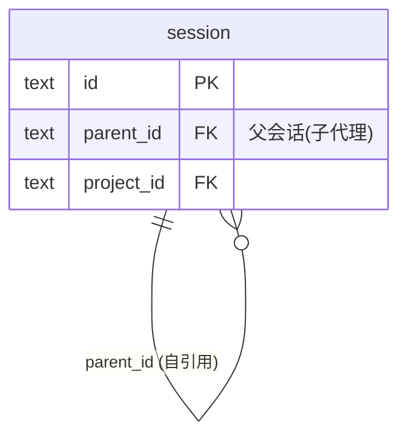

# OpenCode 会话层级与父子关系调研

> 调研时间：2026-07-07
> 调研对象：OpenCode session 表的层级模型
> 关联文档：[02-会话浏览.md](../03-功能模块/02-会话浏览.md)、[02-父子会话层级视图方案.md](../04-技术方案/02-父子会话层级视图方案.md)

## 一、数据模型

### 1.1 表结构（session 表相关字段）

| 字段 | 类型 | 说明 |
|------|------|------|
| id | text PK | 会话 ID |
| parent_id | text FK | 父会话 ID（自引用，可为 NULL） |
| project_id | text FK | 所属项目 ID |
| title | text | 会话标题 |
| time_created | integer | 创建时间 |
| time_updated | integer | 更新时间 |
| time_archived | integer | 归档时间 |

### 1.2 自引用关系



## 二、根会话与子会话

| 类型 | 判断条件 | 语义 |
|------|---------|------|
| 根会话（root） | parent_id IS NULL | 用户主动发起的对话 |
| 子会话（child） | parent_id IS NOT NULL | 子代理（subagent）产生的会话 |

## 三、外键约束

- 外键：`parent_id REFERENCES session(id) ON DELETE CASCADE`
- 删除根会话时，所有子会话级联删除
- 这是 OpenCode 的设计，OpenCode-W 仅遵循

## 四、典型场景

### 4.1 子代理（Subagent）调用

1. 用户在根会话中请求任务
2. 主代理调用子代理（如 search、brainstorming skill）
3. 系统创建子会话，parent_id 指向根会话
4. 子会话独立计算 Token 与成本
5. 子会话结果回传给主代理

### 4.2 统计语义

- 根会话数 = 用户发起的对话次数
- 子会话数 = 子代理调用次数
- 总会话数 = 根 + 子
- 仪表盘拆分展示根/子会话数（v1.1.0 优化）

## 五、OpenCode-W 的兼容策略

- 检测 session 表是否存在 parent_id 列
- 若存在：启用层级视图，支持"只看根会话/显示全部"切换
- 若不存在（旧版 schema）：回退为"全部会话"模式，不展示层级

## 六、相关查询参考

```sql
-- 根会话数
SELECT COUNT(*) FROM session WHERE parent_id IS NULL;

-- 子会话数
SELECT COUNT(*) FROM session WHERE parent_id IS NOT NULL;

-- 某根会话的子会话列表
SELECT * FROM session WHERE parent_id = ?;

-- 按根会话统计子会话数
SELECT s1.id, s1.title, COUNT(s2.id) AS child_count
FROM session s1
LEFT JOIN session s2 ON s2.parent_id = s1.id
WHERE s1.parent_id IS NULL
GROUP BY s1.id;
```
